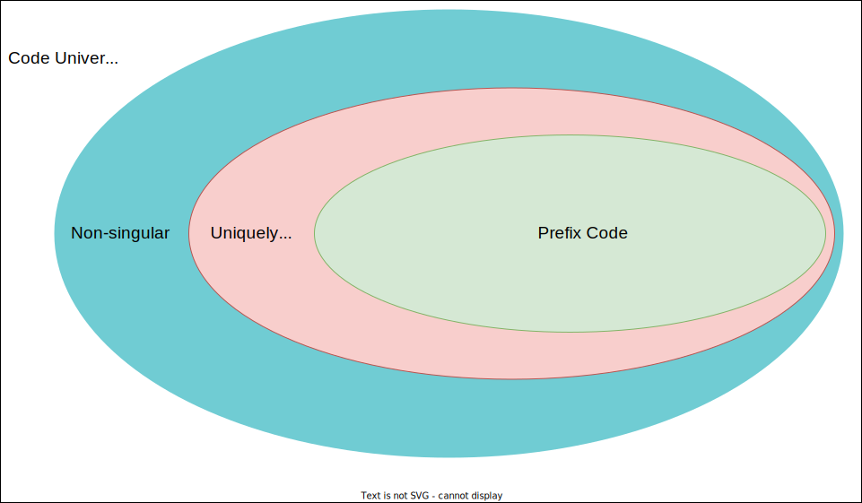

## A Primer on the Coding Theory

- *An alphabet* is a set of symbols, e,g. `{a,b,c,d,e}`, or whatever symbols you like.
- *A code on a given alphabet* (abbr. code) is an assignment of a bit string to each symbol in the alphabet:

    e.g. 

    ```
    { a -> 1 , b -> 011 , c -> 01110 , d -> 1110 , e -> 10011 }
    ```

    The bit string assigned to each symbol (i.e. the right-hand side of each `->`) is known as a *code word*.

- A code is *non-singular* if no code word is duplicate. e.g. code `{a -> 0, b -> 0, c -> 1}` is not non-singular,
  but code `{a -> 0, b -> 1, c -> 01}` is.
- the *extension* of a code is a mapping (i.e. function) from the set of arbitrary sequences of alphabet symbols to the set of bit strings formed by replacing each symbol with its code word and concatenating the results:

    e.g. the extension of the code above is:

    ```
    {
        a -> 1 , b -> 011 , c -> 01110 , d -> 1110 , e -> 10011,
        aa -> 11, aaa -> 111, ....
        ab -> 1011, abb -> 1011011, ...
        
        ... 
    }
    ```

- A code is a *variable-length code* if the length of assigned bit strings differs among symbols. Fixed-length code is not very interesting.
- A variable-length code is *uniquely decodable* if its extension is non-singular.
  (i.e. there is no same bit string on the right-hand side of `->` for the extension).

    Given a code, the Sardinas–Patterson algorithm determines whether it is uniquely decodable in poly-time.

- A variable-length code is a *prefix code* if no code word is a prefix of another.

    e.g. the example used above is not a prefix code since the code word of `b` is a prefix of that of `c`.

    e.g. `{a -> 000, b -> 001, c -> 010, d -> 011, e -> 1}` is a prefix code.

- Every prefix code is uniquely decodable. The inverse is not true.

## Characterize a code



Given an alphabet, we study the practice of converting sequences of source symbols in that alphabet to bit strings by replacing each symbol with its code word and concatenating the result **according to some code**; and the inverse, decode the bit strings back to the source text.

Specifically, we care about whether a given code permits any bit string, provided that it is indeed converted from a source text,
to be uniquely decoded back to the original source text.

1. First, non-non-singular codes are hopeless. `0` can't be uniquely decoded if the code is `{a -> 0, b -> 0}`.
2. Any non-singular code is uniquely decodable if cheating is allowed by adding a separator during encoding:

    `{a -> 0, b -> 00}` is a non-singular but terrible code. Converting `aaaaa -> 00000` is easy but decoding it
    back suffers from multiple interpretations immediately.

    This can be solved by inserting commas during encoding: `aaaaa->0,0,0,0,0`. Now the decoding is unique, but at the
    price of more information transferred.

3. Uniquely decodable code sounds great and smart, right? Not actually. They are not good enough.

    Code `{a -> 0000, b -> 00001, c -> 000011}` is uniquely decodable. We can prove this by observing that all
    code words start with 4 consecutive `0`s. During decoding, the encountering of four `0` marks the start of a new code word
    and the end of the previous one.

    But this code is terrible. There are 2 orthogonal problems going on here:
    1. Redundant bits. We can trim 3 `0`s from each code word and make the code still uniquely decodable;
    2. `{a -> 0, b -> 01, c -> 011}`

    `{a -> 10010, b -> 10010 0000, c -> 10010 0001}`

    Also, note that our proof is not generic.
    Proving a given code is uniquely decodable is not trivial, but still [viable in polynomial time](https://en.wikipedia.org/wiki/Sardinas%E2%80%93Patterson_algorithm).

4. uniquely decodable

    Code `{a -> 0, b -> 10, c-> 011}` is uniquely decodable,
    We can prove this by observing that all

We need a good code design that is:
1. uniquely decodable
2. "short and concise" - we'll explore what that means in the next section.

## Prefix Code & Huffman Coding


Well, still something worth frowning upon.

`{a -> 0, b -> 10, c -> 110}`

The problem is that, 

Imagine you are the receiver seeing bits coming one by one on the wire.
At any given moment, 


we want to be clear about what to do next. At any moment within a codeword, we known whether this
is the end of a codeword or not (i.e. we need to consume the next bit)

Let's capture the essence of being concise: 
We want to following behavior when decoding a bit string: no lookahead is required.

**Proof.** 

Prefix codes are a nice category of uniquely decodable codes.

Given an alphabet, Huffman coding is the most known algorithm for deriving prefix codes.

Prefix codes are widely referred to as "Huffman codes" even when the code was not produced by a Huffman algorithm.

The reverse of a prefix code is known as suffix code.
- Suffix code is still uniquely decodable, and it may still be a prefix code, though not necessarily.

