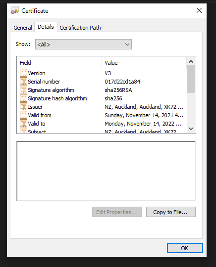

## randomart

`ssh-keygen` now prints an ASCII image, after the key is generated. It is safe to spread the image.
The image serves as a visual fingerprint, an easier way for humans to validate keys.


There is no industrial standard on how . It's openSSH's own feature.

See http://www.dirk-loss.de/sshvis/drunken_bishop.pdf for an analysis.

```
The key fingerprint is:
SHA256:ee296Fbg/INYE48cv5JxJELqUd4BIcQhXeJVwjoYPCk bitier@bite-into-reality
The key's randomart image is:
+--[ED25519 256]--+
|     ..==+*+.    |
|    E =oo++..    |
|     . +.* . .   |
|      . =.o.* .  |
|       .So.=.X   |
|        .. .O.=  |
|           o.O.. |
|          . =.+. |
|           oo... |
+----[SHA256]-----+
```

In implementing bit-order and byte-order
========

|          | pro | con |
|----------|-----|-----|
| LSB0     |     |     |
| MSB0     |     |     |
| LSB last |     |     |
| MSB last |     |     |

### LSB0

Pro
1. C's unsigned integer widening conversion naturally serves as appending unused 0 bit to the bit sequence.

Con
1. Treating consecutive bits as an integer, with first bits be more significant, requires reversing the bit order.

### MSB0


Block Cipher
=========

A block cipher embodies a random permutation generator....


## Windows Root CA Management

Certificate Store is Windows's abstraction for security-sensitive information storage, e.g. SSL certificates.

Windows support 2 certificate stores, a user-specific one and a system-wide one, search for `manage user/computer certificates` in startup respectively. (The latter requires admin privilege.)

Both certificate store is actually backed by the registry.

[Charles guide](https://www.charlesproxy.com/documentation/using-charles/ssl-certificates/) mentions:

> The certificate must be imported into the "Trusted Root Certification Authorities" certificate store, so override the automatic certificate store selection.

Note every application respect Windows' native certificate store. Chrome maintain its own internal Root CA list, and don't give a shit to Windows cert store.

https://www.venafi.com/blog/exploring-chromes-new-root-store-trust-vs-complexity
https://www.zdnet.com/article/chrome-will-soon-have-its-own-dedicated-certificate-root-store/

TODO: explain fields




one-time pad - lacing secret into plaintext
==============

If alice and bob have a shared secret `k` of `n` bits, alice can send secretly (we'l discuss the definition later) a plaintext `m` of also `n` bits to bob by sending:

```
c = m ⊕ k
```

and bob can obtain the original `m` by:

```
m' = c ⊕ k
```

We turned a secret `k` and an message `m` into a secret `c` by XOR.

⊕(XOR) can be considered a binary-native way of propagating unpredictability (to adversary) of one bit sequence to another.  

Unfortunately, 


being computationally infeasible / hardness / difficult in cryptography
===================

In many context, we simply say e.g.
- "it should be hard to find a collision for a good CHF"
- "it should be hard to find plaintext from ciphertext without the key for a good blockcipher", or 
- "it's hard to find discrete logarithm".

None of these says "impossible": given enough amout of time, you can find collision in any CHF with probability 1 by brute force.

Hardness (or more formally, computation infeasibility) isn't a term that has strict mathematical definition.
It's not simply modeled by `the big-O complexity greater than ...` or `the probability of finding ... in m steps is less than ...`,
though sometimes such statements do appear as supportive material for the hardness discussion.

Hardness means the cost of computation (e.g. time / required memory / money to buy hardware) is greater than
the rewards of success in the computation. (e.g. adversary reveal password of a single account or all accounts in the DB).

Neither of the cost nor the rewards can be easily quantified, so the hardness can't be simply asserted by comparing 2 numbers.

The definition of hardness heavily depends on the detailed context of security game in question,
sometimes even on current productivity of current human's industry.
(e.g. no reliable quantum computation is possible *for now*, so breaking discrete log thus AES is hard, *for now*).

avalanche effect
========================

Intuition: flipping a single bit in the input will totally change the whole output.

Terms
==================
integrity       the data i'm receiving is not tampered with. Middle Man flipping even a single bit will be detected.
                but i'm not necessarily sure who the guy sending bits to me is.

Authenticity    I'm doing tcp with remote peer 187.a.b.c:11223, bob told me this is his amazing server, 


Man in the middle attack
---------------
A very nice intro to man in the middle : https://www.youtube.com/watch?v=-enHfpHMBo4

They say ADH is vulerable to man in the middle.

I used to think that man-in-the-middle doesn't work if you put a tag with the ciphertext.

Say Alice and Bob have a 128-bit shared secret already:
    1. They start to talk in AES128-CBC; Eve sees noise, but she can flip a bit, and the recipient can't detect by just looking at the received ciphertext. After decryption the recipient always see garbage, but the crypto system itself doesn't provide a way to detect tampering. Plus, you always have to decrypt first, which is a cost.
    2. They start to talk in AES128-CBC and each ciphertext is appended with the sha256 result of the ciphertext

The real world problem is 

Active MITM don't work if you have a tag. Flipping a single bit will be detected.

Passive MITM

To even have ciphertext, you need to do all the PKE thing and get a shared secret. The PKE thing starts with the server sending its public key to the client IN PLAIN TEXT. A man in the middle can intercept that and replace it with its own public key.


TODO: does self-signed cert protect against MITM attack?
https://security.stackexchange.com/questions/184969/how-mitm-attack-got-performed-on-self-signed-certificate-while-private-keys-is-g


Digital Signature
=======================
People used to say that digital signature is just to use the private key to encrypt the hash of the plaintext.

This could be VERY misleading since it feels like EVERY public key algorithm that has public-private key-pair can be used to do "signature". But actually this mindsetting only works for RSA, and ignorant people just think RSA is the whole public key encryption world.

For example in Diffie-Hellman key exchange, there are public key and private key, but they are NEVER meant to be used to "encrypt" or "decrypt" anything.

