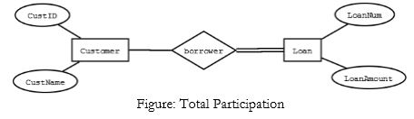

Entity-Relationship Model
-----------

Note for terminology: In the original research by Peter Chen, "entity" is an instance of an "entity-type". There, each entity-type corresponds to 1 table, each row in the table is an "entity", i.e. instance of entity-type. But for simplicity people now just use "entity" for "entity-type".

> Because the term entity-type is somewhat cumbersome, most people tend to use the term entity as a synonym for this term. <cite>-- [wikipedia](https://en.wikipedia.org/wiki/Entity%E2%80%93relationship_model)</cite>

Below we use "entity" for "entity-type" and "an instance of entity" for "entity".

### Entity and Relationship

Entities can be thought of as "nouns", e.g. a computer (a physically existing thing) or a livehouse event (logically entity).

Relationship can be thought of as "verbs" between/among 2 or more entities, e.g. an artist performs multiple songs.

### Participation

The "participation" between **an entity** and **an relationship** describes whether **every** instance of the entities join the relationship.

For example, each load record must correspond to a customer, i.e. `Loan` has **"total participation"** in the relationship `borrower`. But not all customer borrow loan, so `Customer` has **"partial participation"** in the relationship `borrower`.

### Attributes
Both entity and relationship can have attributes:
1. Entity example: a user has a primary key, user name, email, password hash, etc., each becomes a column in SQL table.
2. Relationship example: The relationship "proved" between an authority and a client might have an attribute of "date".

ER Model to Relational Model
---------
1. All entities should have a uniquely identifying attribute called "primary key".
2. Each entity becomes a table, all its attributes become columns in the table.
3. Rules by cardinality between entity `A` and `B`:
    1. `A:B = 1:1`: **merge table A and B into one table with relationship attribute**, or add foreign key to the other and relationship attribute at either A or B table.
    2. `A:B = 1:N`: add foreign key to A row and relationship attributes in table B (i.e. add FK to 1 from N, add rela-attr to N). e.g. a classroom is associated multiple students, but a student can only be assigned to 1 classroom; We add FK from student table to PK of classroom table;
    3. `A:B = N:M`: make a table for the relationship itself, add FK to PK of A, add FK to PK of B, use the combination of 2 FK as PK.

Normal Forms
--------------

### 1NF

1NF is the most basic normal form, enforcing that **all columns is **.

### 3NF

### 
