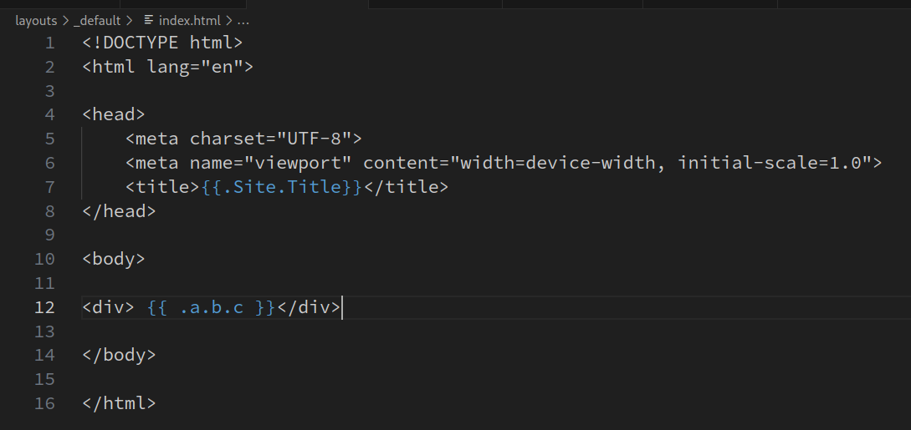

This article is a paraphrase of the [`text/template` package documentation](https://pkg.go.dev/text/template#pkg-overview)
since I find its narration structure chaotic and unintuitive.
New users of the Go template system may find this article easier to begin with.

The idea of all template systems is to replace placeholders in a large chunk of text with corresponding
values determined at run time.

## template file

A go template file (usually with extension `.gotmpl` or simply `.html`) is a text file consisting of actions and non-action text.

Rendering (or say executing) a template file with a group of runtime data produces a result output,
which can be sent TODO.

Non-action text is copied to the output verbatim.

An action is one of the following constructs:

```
{{/* a comment */}}
{{- /* a comment with white space trimmed from preceding and following text */ -}}
	A comment; discarded. May contain newlines.
	Comments do not nest and must start and end at the
	delimiters, as shown here.

{{pipeline}}
	The default textual representation (the same as would be
	printed by fmt.Print) of the value of the pipeline is copied
	to the output.

{{if pipeline}} T1 {{end}}
	If the value of the pipeline is empty, no output is generated;
	otherwise, T1 is executed. The empty values are false, 0, any
	nil pointer or interface value, and any array, slice, map, or
	string of length zero.
	Dot is unaffected.

{{if pipeline}} T1 {{else}} T0 {{end}}
	If the value of the pipeline is empty, T0 is executed;
	otherwise, T1 is executed. Dot is unaffected.

{{if pipeline}} T1 {{else if pipeline}} T0 {{end}}
	To simplify the appearance of if-else chains, the else action
	of an if may include another if directly; the effect is exactly
	the same as writing
		{{if pipeline}} T1 {{else}}{{if pipeline}} T0 {{end}}{{end}}

{{range pipeline}} T1 {{end}}
	The value of the pipeline must be an array, slice, map, or channel.
	If the value of the pipeline has length zero, nothing is output;
	otherwise, dot is set to the successive elements of the array,
	slice, or map and T1 is executed. If the value is a map and the
	keys are of basic type with a defined order, the elements will be
	visited in sorted key order.

{{range pipeline}} T1 {{else}} T0 {{end}}
	The value of the pipeline must be an array, slice, map, or channel.
	If the value of the pipeline has length zero, dot is unaffected and
	T0 is executed; otherwise, dot is set to the successive elements
	of the array, slice, or map and T1 is executed.

{{break}}
	The innermost {{range pipeline}} loop is ended early, stopping the
	current iteration and bypassing all remaining iterations.

{{continue}}
	The current iteration of the innermost {{range pipeline}} loop is
	stopped, and the loop starts the next iteration.

{{template "name"}}
	The template with the specified name is executed with nil data.

{{template "name" pipeline}}
	The template with the specified name is executed with dot set
	to the value of the pipeline.

{{block "name" pipeline}} T1 {{end}}
	A block is shorthand for defining a template
		{{define "name"}} T1 {{end}}
	and then executing it in place
		{{template "name" pipeline}}
	The typical use is to define a set of root templates that are
	then customized by redefining the block templates within.

{{with pipeline}} T1 {{end}}
	If the value of the pipeline is empty, no output is generated;
	otherwise, dot is set to the value of the pipeline and T1 is
	executed.

{{with pipeline}} T1 {{else}} T0 {{end}}
	If the value of the pipeline is empty, dot is unaffected and T0
	is executed; otherwise, dot is set to the value of the pipeline
	and T1 is executed.
```

A `pipeline` is an expression that will be evaluated during the rendering. Its result will
critically affect the branching or loop logic, or simply be sent to the output, depending on the action it is in.

A `pipeline` is one of the following:
- `Argument`
- `.Method [Argument...]`: invoke 
- `functionName [Argument...]`: 

and an `Argument` is one of:

- A boolean, string, character, integer, floating-point, imaginary or complex constant in Go syntax.

    These behave like Go's untyped constants. Note that, as in Go, whether a large integer constant overflows when assigned or passed to a function can depend on whether the host machine's ints are 32 or 64 bits.

- The keyword `nil`, representing an untyped Go `nil`.
- The character '.' (period): . The result is the value of dot.
- A variable name, which is a (possibly empty) alphanumeric string preceded by a dollar sign, such as $piOver2 or $ The result is the value of the variable. Variables are described below.
- The name of a field of the data, which must be a struct, preceded by a period, such as .Field

    The result is the value of the field. Field invocations may be chained: .Field1.Field2 Fields can also be evaluated on variables, including chaining: $x.Field1.Field2

- The name of a key of the data, which must be a map, preceded by a period, such as .Key

    The result is the map element value indexed by the key. Key invocations may be chained and combined with fields to any depth: .Field1.Key1.Field2.Key2 Although the key must be an alphanumeric identifier, unlike with field names they do not need to start with an upper case letter. Keys can also be evaluated on variables, including chaining: $x.key1.key2

- The name of a niladic method of the data, preceded by a period, such as `.Method`

    The result is the value of invoking the method with dot as the receiver, dot.Method(). Such a method must have one return value (of any type) or two return values, the second of which is an error. If it has two and the returned error is non-nil, execution terminates and an error is returned to the caller as the value of Execute. Method invocations may be chained and combined with fields and keys to any depth: .Field1.Key1.Method1.Field2.Key2.Method2 Methods can also be evaluated on variables, including chaining: $x.Method1.Field
    
- The name of a niladic function, such as fun The result is the value of invoking the function, fun(). The return types and values behave as in methods. Functions and function names are described below.
- A parenthesized instance of one the above, for grouping. The result may be accessed by a field or map key invocation. print (.F1 arg1) (.F2 arg2) (.StructValuedMethod "arg").Field

## `(text|html)/template` APIs

This section focuses on the go code, and explains how an external `.gotmpl` template file can be executed by go code.

Code will start with `import "text/template"` or the `html` counterpart, which brings the `template` package identifier.

Now, A free function `template.New()` in that package should be used to create a new empty `Template` instance; content can be filled later by `Template.ParseFiles()` method. A convenient free function `template.ParseFiles()` is provided that does both in one call.

Each `Template` instance internally maintains
1. a collection of `block`s. `blocks` are parsed from template files. Each block has a name.
2. a `FuncMap` instance, which is a mapping from names to function pointers.


## Misc

### Passing multiple arguments to `{{ template ... }}`

The syntax of the `{{template "name" pipeline}}` action determined that only 1 pipeline is allowed as argument.
The value of the pipeline can be referred to as `.` within the referred template.

If more than 1 value needs to be passed to the target template, one must wrap them in a `map`.
Go template doesn't have built-in support for this, and a helper function must be supplied by the client programmer.

```
```

https://stackoverflow.com/questions/18276173/calling-a-template-with-several-pipeline-parameters

Many go-based SSR frameworks, including hugo, does this too.

### `html/template` syntax highlight support in VSCode

tl;dr: [the official `vscode-go` extension](https://marketplace.visualstudio.com/items?itemName=golang.Go) registers the `gotmpl` langauge mode;
but the team, as of Feb. 2024, [doesn't have a plan](https://github.com/golang/vscode-go/issues/609#issuecomment-1714669400) to support co-existence of HTML highlight and Go template highlight. Also, IntelliSense is unavailable.

The most you can get out of the official plugin is a 
... based on the so-called `semanticTokens` feature from the `gopls` language server. It looks like:



Emmet is disabled for the `gotmpl` langauge mode by default.
See [here](https://code.visualstudio.com/docs/editor/emmet#_emmet-abbreviations-in-other-file-types) for enabling it.

