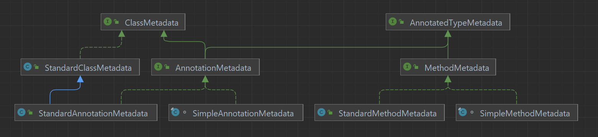

The whole Spring ecosystem make extensive use of Java's annotation mechanism. This article will briefly discuss how annotations handled, and the spring framework.

Before start talking about Spring's infrastructure of annotation handling, you may want to hear my words on the design flaw of java's annotation, and why they sometimes brings trouble and can be slippery to beginners. [TODO: reference]

<!--

-->

Whoever wants to associate an `@Foo` instance with some `public class Bar {}` and make the presense of `@Foo` available from `Bar.class` reflection API 

---

native JDK should not support "transitivity" of annotation in any sense.


targetable construct (say a  definition) without directly tagging `@Foo` on that construct directly must implement such association with their own code. i.e. such indirect association should not be supported by `java.lang.reflect` in any form.

Oracle do the opposite, by making a few APIs in `Class<?>` respecting the `@Inherited` meta-annotation.
This causes chaos in.

 In an ideal world, you 

    Now I said "should not". Let's face the miserable reality: `@Inherited`. `@Inherited` is a notorious design failure. It should not ever existed in JDK.

1. dasd

## Representation of annotated stuff metadata

Spring has a weirdly named iface hierarchy for representing parsed information on class and method:

```yml
# common APIs for accesssing parsed annotation info on annotated *things* in java,
interface AnnotatedTypeMetadata (core.type)

    # adds API for accesssing parsed annotation on method - why not AnnotatedMethodMetadata??
    - interface MethodMetadata (core.type)             
        - class StandardMethodMetadata (core.type)
        - class SimpleMethodMetadata (core.type.classreading)
        - class MethodMetadataReadingVisitor (core.type.classreading)

    # adds API for accesssing parsed annotation on class - why not AnnotatedClassMetadata??
    - interface AnnotationMetadata (core.type)
        - class StandardAnnotationMetadata (core.type)
        - class SimpleAnnotationMetadata (core.type.classreading)
        - class AnnotationMetadataReadingVisitor (core.type.classreading)
```



## API & Parsing Details

You always parse the annotation info of a given class, and annotation info on a specific method of that class comes as a gift,
via the `AnnotationMetadata.getAnnotatedMethods()` method.

Since Spring 5, static method `static AnnotationMetadata introspect(Class<?> type)` becomes the recommended API to introspect
any class for its annotation info. It deprecates the old way of `new StandardAnnotationMetadata(clazz)` ctor.

`org.springframework.context.annotation.ConfigurationClassParser`

## Meta-annotation handling

Spring extensively use meta-annotation to create so-called annotation and composed annotation:
1. An `@Service`-annotated class should be treated as if it is `@Component`-annotated across the whole Spring ecosystem,
since `public @interface Service{...}` is meta-annotated by `@Component`.
2. An `@SpringBootConfiguration`-annotated class should be treated as if it is
 annotated by `@SpringBootConfiguration`, `@EnableAutoConfiguration` and `@ComponentScan`, 
 since `public @interface SpringBootConfiguration{}` is meta-annotated by these 3.

*Definitions*:
1. A class is *directly-annotated* 

It would be less confusing if the only annotation introspection supported by JDK is direct annotation, i.e.
if all APIs in `Class<T>` simply answer based whether annotations are directly tagged on `T` class.

If that was true, everyone who wants to benefits...

However, this programming model ("the annotation of my annotation is my annotation") is not natively supported by `java.lang.reflect`.
There is no existing API that respect such transition fo 

```java
@Target(ElementType.ANNOTATION_TYPE)
@Retention(RetentionPolicy.RUNTIME)
public @interface MyMetaAnnotation { }

@MyMetaAnnotation
@Retention(RetentionPolicy.RUNTIME)
@Target(ElementType.TYPE)
public @interface Foo { }

@Foo
public class SomeService { }
```

What JDK indeed is that...

