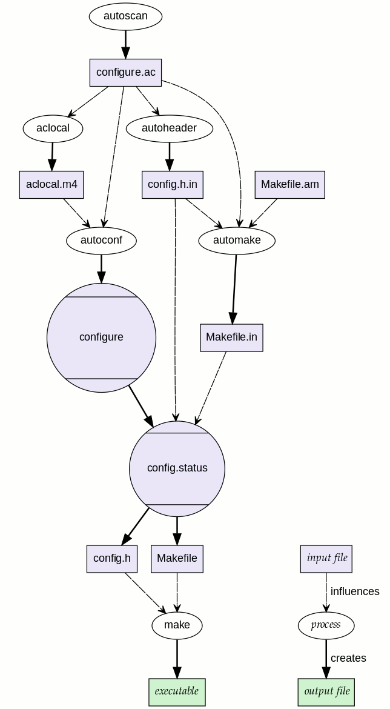

In the very beginning of open source project practice people manually write scripts that setup the build system

-----



the `autoconf` package
===========

https://www.gnu.org/software/autoconf/

The `autoconf` package install the following binary in `/usr/bin`:

The primary responsibility of `automake` is to generate a `configure` script from a `configure.ac` file.

The generated `configure` upon invocation will:
1. instantiate an existing `Makefile.in` into an actual `Makefile`.
2. TODO
3. ...

- `autoscan`: creates `configure.ac` prototype

    Program `autoscan` scans current working directory for C/C++ sources that may causes compatibility problems, and generates a `configure.scan` file. Users are supposed to check and modify that file, and rename it to `configure.ac`. Specifically, `AC_CONFIG_HEADERS` for a `config.h.in` and `AC_CONFIG_FILES` for Makefiles won't be generated, and requires manual interference.

- `autoheader`: 
- `autom4te`: 
- `autoconf`: 
- `autoreconf`: 
- `autoupdate`: 
- `ifnames`: 

the `automake` package
========

https://www.gnu.org/software/automake/


`aclocal` and `automake` `usr/bin/`

Automake is a seperate package.

Historical projects manually maintain `Makefile.in`, instead of generated from `Makefile.am`.
Invocation of the `configure` script will generate an actual `Makefile` from its `.in` template.
See [sudo]() for an example

people use autoconf to generate the `configure` script from a manually maintained `configure.ac`,
but manually write their .

`autoheader`: creates `config.h.in` from `configure.ac`
================

```m4
AC_CONFIG_HEADERS(HEADERS...)
```

Use only one such header unless you know what you are doing.
`autoheader` by default creates `HEADER.in` only for the first `HEADER`.

When multiple `HEADER` are provided, ... TODO

`automake`: creates `Makefile` from `Makefile.am`
================

```m4
AC CONFIG FILES(FILES...)
# e.g
AC_CONFIG_FILES([Makefile sub/Makefile script.sh:script.in])
```

Create `FILE` for all `FILE.in`.
`FILES` contain definitions made with `AC_SUBST`.

autom4te
=================

autoconf-flavored wrappered around m4.
`autom4te` itself is a perl script

`*.in` files
==============

`.in` files are templates where `@XYZ@` are placeholders for
`AC_SUBST([XYZ])` definitions.

`Makefile.in`s also use `@XYZ@` as placeholders but Automake makes all `XYZ=@XYZ@` definitions, and you may simply use `$(XYZ)` as needed.

aclocal
================

Program `aclocal` generates `aclocal.m4` by scanning `configure.ac`.

libtool
=================
