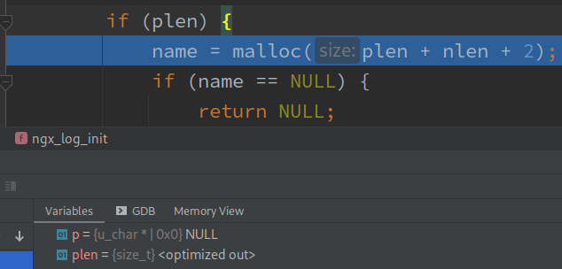

## Environment Setup

### Build from source with debug flags

```bash
hg clone https://hg.nginx.org/nginx
# a linux build can be done without os/win32
rm -rf nginx/src/os/win32
mkdir install
cd nginx
./auto/configure --with-debug --prefix="$(realpath ../install)" --with-cc-opt='-ggdb3 -O0'
make -j8
make install
```

Note: By default nginx does out-of-source build in a directory called `objs/`. Call `configure` with `--builddir=` flag to change it. **Do not name your custom build directory `build`, it shadows the `build` goal in the main `Makefile`.** (yes, nginx folks don't use `.PHONY`)

`--with-debug` will define the `NGX_DEBUG` macro to 1, enabling logging functions for debug in `core/ngx_log.h`.

`-ggdb3` flag is real: search for `-ggdblevel` in `man gcc`. The `configure` script will generate a `objs/Makefile` that use `-g` by default. `-ggdb3` will be appended to the end of the `CFLAGS` variable, thus override the insufficient `-g`:

Nginx by default enable `-O`. We override it with `-O0`. `man gcc` recommends using `-Og` over `-O0` for debugging, BUT `-Og` still optimizes out too much variables for me, and some return statements are eliminated, so you can't breakpoint on them, so no.



(Important flag variable `plen` is optimized out under `-Og`.)

```bash
$ head objs/Makefile  | grep CFLAGS
CFLAGS =  -pipe  -O -W -Wall -Wpointer-arith -Wno-unused-parameter -Werror -g -ggdb3 -O0
```

### Test compiled executable

```bash
cd nginx_install
# change conf/nginx.conf to use non-privileged port.
./sbin/nginx
curl localhost:8000
./sbin/nginx -s quit
```


### Config for Debug

By default the `nginx` executable after invoked, will (exec or fork-exec?) the master process, which read the conf file and spawn the worker processes. 2 conf directives affect this behavior:

1. `daemon on|off;` (default: `on`)
    
    Set to `off` to prevent the `nginx` executable from detaching from the terminal. This allows the shell to forward all keyboard event signals (e.g. `Ctrl-C` for `SIGINT`) directly to the master (and workers?) process. There will still be master and worker processes, all connected to the same terminal.

2. `master_process on|off;` (default: `on`)

    Set to `off` to prevent the `nginx` executable process from spawning the master process **and** worker processes. It will be the only process of nginx, handling everything.

By default all nginx processes prints nothing to `stdout` or `stderr`. `error_log` can be printed to `stderr` by using the `error_log stderr;` conf directive or the `-e stderr` CLI flag. There is no way for HTTP `access_log` to be printed to `stdout` or `stderr`.

Special Headers
--------------

### Config & Core

`ngx_config.h` and `ngx_core.h` must be included **at the very beginning** of all translation units source in nginx. You must `#include <ngx_config.h>` first, then `#include <ngx_core.h>`.

`#include <ngx_config.h>` brings important feature test macros like `_GNU_SOURCE`, so that all headers being included after that line can benefit from it. It also:

- includes `ngx_auto_headers.h`, which will be generated by the `configure` script at build time in the `--builddir`, to understand OS types and features.
- On linux, the macro `NGX_LINUX` will be defined to `1`, thus the platform-specific `ngx_linux_config.h` will be included. 

`ngx_linux_config.h`:

- `<sys/types.h>` defines `u_char` on linux. ([about `u_char`](https://stackoverflow.com/questions/1918934/is-u-char-a-standard))
- includes standard headers e.g. `stdio.h`, `stdlib.h`; maybe Igor forgets to merge those includes into `ngx_config.h`.

`ngx_core.h`:
- includes lots of common utilities headers, e.g. the ones for time,socket, regex, data structures, log, memory pool, etc.
- Lots of `struct xxx_s` are typedef-ed to `xxx_t` for convenience.
- 7 nginx standard return code and other utility macros are defined.

### Build-time Config / Feature Testing

`ngx_auto_config.h` and `ngx_auto_headers.h` will be generated at build time in `--builddir`. All definitions presented are defined to 1, and absent macros are considered disabled.

`ngx_auto_config.h` contains macro definitions regarding:

- build environment information, e.g.
	- `NGX_PTR_SIZE`: the size of a pointer in the current system.
	- `NGX_SYS_NERR`: Number of `errno` supported by the system, assuming consecutive and right-exclusive: `[0,NGX_SYS_NERR)`.
- available OS features, e.g. `NGX_HAVE_EPOLL` indicates `epoll` is available.
- `./configure` flags, either defaulted or overwritten on the command line.

`ngx_auto_headers.h` contains macro definitions regarding OS type and availability of important system headers.

- `NGX_LINUX`: is building for linux.
- `NGX_HAVE_XXX_H`: header `<xxx.h>` is available.

OS-specific Code and OS-conditioned Compilation
--------------

`os/unix/ngx_os.h`:

- provides declaration of common types/globals/functions on all POSIX systems. Implementations of `ngx_os_specific_[init|status]()` are OS-dependent, and are defined in respective `ngx_<OS>_init.c` file, while implementation of other functions are common POSIX and defined in `ngx_posix_init.c`, `ngx_process.c`, `ngx_daemon.c`, etc.
- conditionally includes a OS-specific header based on the system type in `ngx_auto_headers.h` (in my case `NGX_LINUX`, and includes `<ngx_linux.h>`), which brings declarations of OS-dependent types/globals/functions that can be used in ad-hoc conditional compilation section across the codebase. (`<ngx_linux.h>` only declares 1 more function.) Implementation of such functions are always OS-dependent, defined in `ngx_<OS>.c`.

The `Makefile` generated by `configure` scripts controls which files are compiled and linked together, thus provides correct OS-specific symbols.

FileSystem I/O
---------------

### `ngx_open_file_t` (`core/ngx_conf_file.h`)

The simplest structure file that
1. wraps a fd,
2. embeds the name of the file, and 
3. functions that work with it don't log. (since the logger type `ngx_log_t` embeded a pointer to this type, logging will cause infinite recursion.)

```c
// add `ngx_open_file_t` to cycle
ngx_open_file_t *ngx_conf_open_file(ngx_cycle_t *cycle, ngx_str_t *name);
```

### `ngx_file_t` (`core/ngx_file.h`)


## Network I/O

### `ngx_connection_t`

### Socket Abstraction

### Epolling

## Nginx Module

A "module" in nginx is a set of source files that

1. can be independently included in / excluded from an nginx build
2. marked by a global `ngx_module_t` instance in one of those source files,
3. provide specific functionalities (e.g. webp image support) and recognize new configuration directives, and
4. whose functions will be invoked in some stage of the nginx lifecycle

Some modules are built by default ([here for a list](https://docs.nginx.com/nginx/admin-guide/installing-nginx/installing-nginx-open-source/#modules-built-by-default)), and are always statically-linked into the executable. Others requires explicit arguments to the `./configure` to be build, and most are still static-linked.

Only 7 modules can be built as `.so` and loaded at runtime:

```bash
$ curl -s 'http://nginx.org/en/docs/configure.html' | grep '=dynamic'
<code>--with-http_xslt_module=dynamic</code>
<code>--with-http_image_filter_module=dynamic</code>
<code>--with-http_geoip_module=dynamic</code>
<code>--with-http_perl_module=dynamic</code>
<code>--with-mail=dynamic</code>
<code>--with-stream=dynamic</code>
<code>--with-stream_geoip_module=dynamic</code>
```

A module is identified by the presence of a global variable of type `ngx_module_t` defined in one of that set of source files. For example, the `ngx_regex_module` global variable defined in `core/ngx_regex.c` marks the `ngx_regex_module`.

It's confusing that nginx puts all source files together. You don't know which files belong to which module. For core modules (TODO: define "core modules"?), inspect `auto/sources`. For other modules, inspect `auto/modules`.

### Module Type

Each module has a type, marked by the `type` member of the `ngx_module_t`. It's meant to be one of the following macro:

```c
// core/ngx_conf_file.h
#define NGX_CORE_MODULE      0x45524F43  /* "CORE" */
#define NGX_CONF_MODULE      0x464E4F43  /* "CONF" */

// http/ngx_http_config.h
#define NGX_HTTP_MODULE           0x50545448   /* "HTTP" */

// event/ngx_event.h
#define NGX_EVENT_MODULE      0x544E5645  /* "EVNT" */

// mail/ngx_mail.h
#define NGX_MAIL_MODULE         0x4C49414D     /* "MAIL" */

// stream/ngx_stream.h
#define NGX_STREAM_MODULE       0x4d525453     /* "STRM" */
```

The **only** module of type `NGX_CONF_MODULE` is a module named `ngx_conf_module` in `core/ngx_conf_file.c`.

Also, all modules of the same types shares the same:

- data type of module private data (but different instance)
- conf parse & init function

### Module Private Data 

For a given module of type `NGX_X_MODULE` (X be one of `CORE|HTTP|EVENT|MAIL|STREAM`), its global `ngx_module_t` instance contains a member `void *ctx` that points to a `static` global instance of type `ngx_x_module_t` named `ngx_x_module_ctx`.

## Logging Facilities

The form of logging functions heavily depends on if variadic macros are supported. On my system those 2 are defined to 1 in `ngx_auto_config.h`:

- `NGX_HAVE_C99_VARIADIC_MACROS`
- `NGX_HAVE_GCC_VARIADIC_MACROS`

If any of the two macros if defined, a further macro `NGX_HAVE_VARIADIC_MACROS` will be set to 1.

`ngx_log_error_core()` is the very core logging function. It's always a C function, although its signature depends on `NGX_HAVE_VARIADIC_MACROS`:

```c
#if (NGX_HAVE_VARIADIC_MACROS)
void ngx_log_error_core
(ngx_uint_t level, ngx_log_t *log, ngx_err_t err, const char *fmt, ...)
#else
void ngx_log_error_core
(ngx_uint_t level, ngx_log_t *log, ngx_err_t err, const char *fmt, va_list args)
#endif
{
// ... function body
```

Given the support for variadic macros on my OS, others are just wrappers around `ngx_log_error_core`:

- `ngx_log_error()`
    
    Print a message to `log` only if `level` is equally or more severe than its threshold severity.

    ```c
    #define ngx_log_error(level, log, ...) \
        if ((log)->log_level >= level) \
            ngx_log_error_core(level, log, __VA_ARGS__)
    ```

- `ngx_log_debug()`

    Print a message to `log` only if it's configured to accept such debug message.

    ```c
    #define ngx_log_debug(level, log, ...) \
        if ((log)->log_level & level) \
            ngx_log_error_core(NGX_LOG_DEBUG, log, __VA_ARGS__)
    ```

- `ngx_log_debug{0..8}()`

    ```c
    #define ngx_log_debug0(level, log, err, fmt) \
        ngx_log_debug(level, log, err, fmt)
    #define ngx_log_debug1(level, log, err, fmt, arg1) \
        ngx_log_debug(level, log, err, fmt, arg1)
    #define ngx_log_debug2(level, log, err, fmt, arg1, arg2) \
        ngx_log_debug(level, log, err, fmt, arg1, arg2)
    // ...
    ```

    If varaidic macro support are certainly available, we could just call `ngx_log_debug()` for arg lists of all length.

- `ngx_log_debug_core()`

    Ignored. Is only defined and useful when system doesn't have variadic macro support.